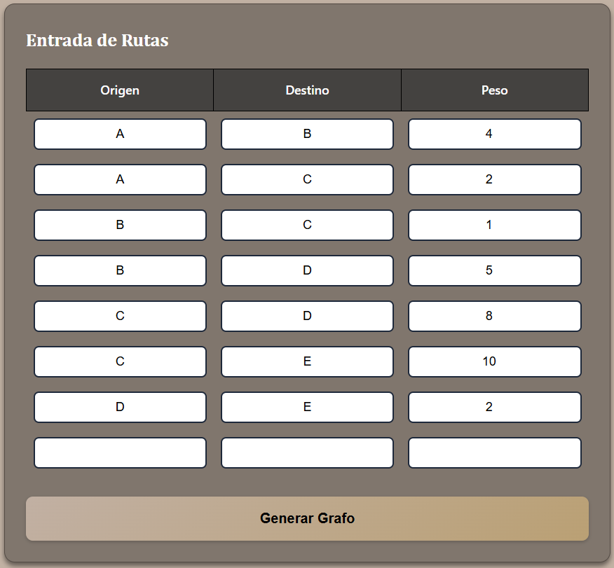
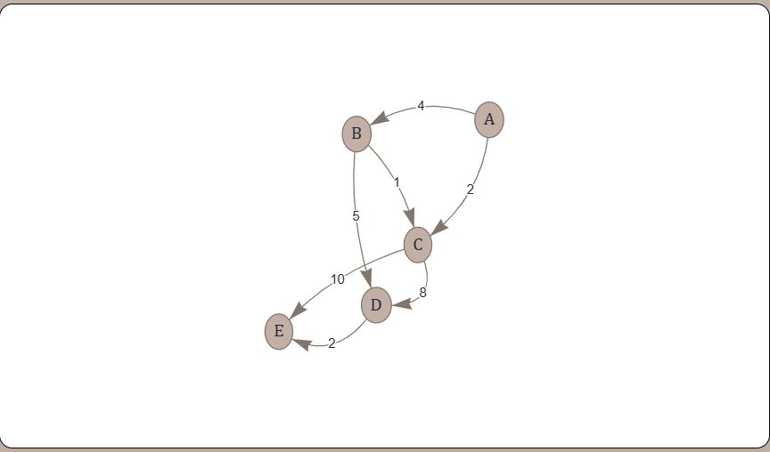
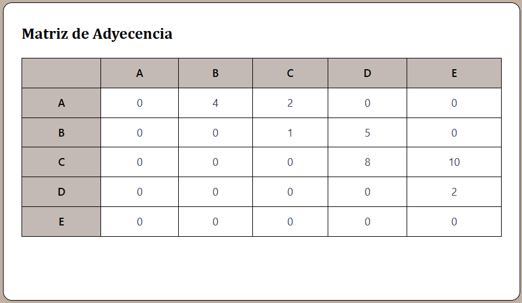
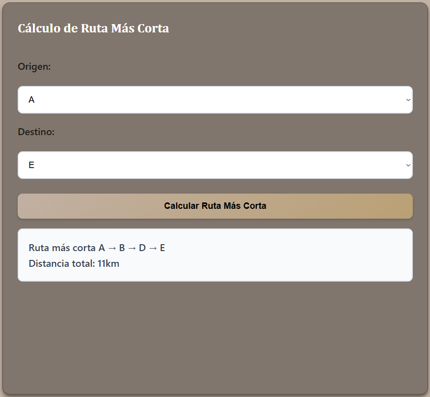

# 🌐 Generador de Grafos

Una aplicación web para crear, visualizar grafos y calcular rutas más cortas usando el algoritmo de Dijkstra.

## 🚀 Demo en Vivo

**[Ver Demo](https://tenqy.github.io/Representacion-Computacional-Grafos)**

## ✨ Características

- **Visualización de Grafos**: Renderizado usando Vis.js
- **Grafos Dirigidos y No Dirigidos**: Puedes elegir el tipo de grafo
- **Matriz de Adyacencia**: Se genera automáticamente
- **Algoritmo de Dijkstra**: Encuentra la ruta más corta entre dos vértices
- **Interfaz Simple**: Tabla para ingresar los datos

## 🖼️ Capturas de Pantalla


*Interfaz principal con tabla de entrada de rutas*


*Ejemplo de grafo generado*


*Matriz de adyacencia del grafo*


*Cálculo de ruta más corta entre dos vértices*

## 🛠️ Tecnologías

- HTML5, CSS3, JavaScript
- Vis.js para visualización de grafos

## 🔧 Instalación

1. Clona el repositorio:
```bash
git clone https://github.com/TenQy/Representacion-Computacional-Grafos.git
```

2. Abre `index.html` en tu navegador

## 📖 Cómo usar

1. **Crear Grafo**: 
   - Marca "Grafo dirigido" si quieres flechas en las conexiones
   - Llena la tabla con: Origen, Destino y Peso
   - Haz clic en "Generar Grafo"

2. **Calcular Ruta**:
   - Selecciona origen y destino
   - Haz clic en "Calcular Ruta Más Corta"

### Ejemplo de datos:
```
Origen | Destino | Peso
   A   |    B    |  4
   A   |    C    |  2
   B   |    C    |  1
   B   |    D    |  5
   C   |    D    |  8
   C   |    E    |  10
   D   |    E    |  2
```

## 📁 Archivos del Proyecto

```
Representacion-Computacional-Grafos/
├── index.html          # Página principal
├── styles.css          # Estilos
├── script.js          # Código JavaScript
└── images/            # Capturas de pantalla
```

## 📝 Licencia

MIT License